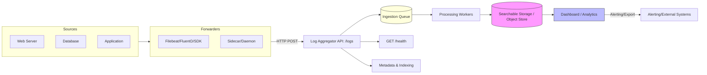

# Log Aggregator Service

Centralize, aggregate and query logs coming from heterogeneous sources (web servers, databases, application instances) so that they are not scattered across machines and systems. This service acts as a central ingestion endpoint and an API-driven query interface, suitable for integration with log forwarders, dashboards and alerting systems.

---

## 🔧 What this project does

- Collects logs from multiple sources (web server, DB, app) via HTTP/REST (and future adapters like UDP, gRPC, message brokers).
- Stores and indexes logs in a backend of choice (Elasticsearch, ClickHouse, PostgreSQL, S3, etc.).
- Offers a simple REST API for ingestion and querying.
- Designed to support high-throughput ingestion and downstream analytics/alerting.

> This repo is a starter API built with NestJS — the initial implementation provides a minimal API and infrastructure scaffold. This README includes a proposed API flow and usage patterns for a production-ready log aggregator.

---

## 📌 Key features

- Centralized HTTP logs ingestion endpoint (planned: `POST /logs`) accepting single or bulk log events
- Lightweight, pluggable storage backends
- Search/query API (planned: `GET /logs`) with filters (service, level, timestamp range, text search)
- Health and diagnostics endpoints
- Simple to run locally with `npm` scripts

---

## 🧭 API Flow (Mermaid)

Below is a high-level API flow diagram showing how logs travel from sources to the aggregator and then to storage/analytics:



> The diagram above is a recommended architecture for an aggregator service — the repo currently contains a base API skeleton to begin development.

---

## ✅ Design / Data Model (Example)

A single log event example (JSON):

```json
{
  "timestamp": "2025-11-27T10:25:00.000Z",
  "level": "error",
  "service": "user-service",
  "host": "app-02.prod",
  "message": "User creation failed: validation error",
  "requestId": "req-123abc",
  "metadata": {
    "userId": "user-42",
    "errorType": "ValidationError",
    "stack": "..."
  }
}
```

Bulk ingestion (array of events) is supported in the ingestion payload as a single POST request — this is recommended to reduce API calls.

---

## 🚀 Quickstart

Prerequisites: Node.js (16+), npm

From the repository root:

```bash
# install dependencies
npm install

# run the app in development mode
npm run start:dev

# build for production
npm run build

# run unit tests
npm run test

# run e2e tests
npm run test:e2e
```

The default port is `3000`. To run with a different port set the `PORT` environment variable:

```bash
# fish syntax
set -x PORT 4000
npm run start:dev
```

---

## 📡 API (Planned / Example)

> Note: This repository includes a minimal controller (`GET /`) as a template; detailed endpoints are provided as the API design. Use these as references when adding new controllers.

Implemented endpoints in this starter:

- `GET /` — returns a simple message: `Hello World!` (see `src/app.controller.ts` and `src/app.service.ts`)

Planned endpoints to implement:

- GET / — health or welcome endpoint (Implemented)
- GET /health — returns a small JSON with status (Planned)
- POST /logs — ingest one or more log events (Planned)
- GET /logs — query logs with filters (Planned)

### POST /logs (Example)

```
POST /logs
Content-Type: application/json

# single event
{ "timestamp": "2025-11-27T10:25:00.000Z", "service": "web", "level": "info", "message": "..." }

# bulk
[{...}, {...}]
```

Response: 202 Accepted for asynchronous ingestion or 200 OK for synchronous ingestion. Provide an ID or an array of IDs when accepted.

### GET /logs (Example query)

```
GET /logs?service=user-service&level=error&from=2025-11-27T00:00:00Z&to=2025-11-27T23:59:59Z
```

Response: Paginated results with log events matching filters.

### Example CURL requests

Single event ingestion (sync/simplified):

```bash
curl -X POST http://localhost:3000/logs \
  -H "Content-Type: application/json" \
  -d '{"timestamp":"2025-11-27T10:25:00Z","service":"web","level":"info","message":"User login success","metadata":{"userId":"user-1"}}'
```

Bulk ingestion:

```bash
curl -X POST http://localhost:3000/logs \
  -H "Content-Type: application/json" \
  -d '[{"timestamp":"2025-11-27T10:25:00Z","service":"web","level":"info","message":"User login"},{"timestamp":"2025-11-27T10:25:01Z","service":"api","level":"error","message":"DB timeout"}]'
```

Query API (example using filter query string):

```bash
curl 'http://localhost:3000/logs?service=web&level=info&from=2025-11-27T00:00:00Z&to=2025-11-27T23:59:59Z&page=1&pageSize=50'
```

---

## 🛠️ Configuration (Environment Variables)

- PORT: server port to listen on (default 3000)
- LOG_STORAGE_URL: connection string / URL to the chosen storage backend
- QUEUE_URL: connection to message queue (Redis/Kafka) for ingestion buffering
- NODE_ENV: development|production

> When adding storage/backends, add appropriate environment configs and examples here.

---

## 💡 Tips for Production

- Use a scalable queue or broker (Kafka, Redis Streams) between ingestion and processors
- Persist raw logs to object storage for cold archiving + indexed storage for fast queries
- Add rate limiting and authentication for ingestion endpoints to avoid misuse
- Add index lifecycle policies (ILM) or retention strategies to manage storage costs

---

## 🧪 Development & Testing

- Unit tests: `npm run test`
- e2e tests: `npm run test:e2e`
- Lint & format: `npm run lint` and `npm run format`

---

## 📘 Contribution

Contributions are welcome. Open issues for design proposals and add PRs for specific features (ingestion, storage adapters, query API, analytics connectors).

- Add tests for new endpoints
- Document any new storage adapters and how to configure them

---

## 📜 License

UNLICENSED — see `package.json` for details. Adjust to your preferred open source license if you wish to publish this project publicly.

---

## 📞 Contact / Acknowledgements

This project started as a NestJS starter repository and was adapted into a log aggregator service scaffold. If you want help designing or implementing specific adapters/storage, describe the target backend and scale requirements and we can propose an implementation plan.


